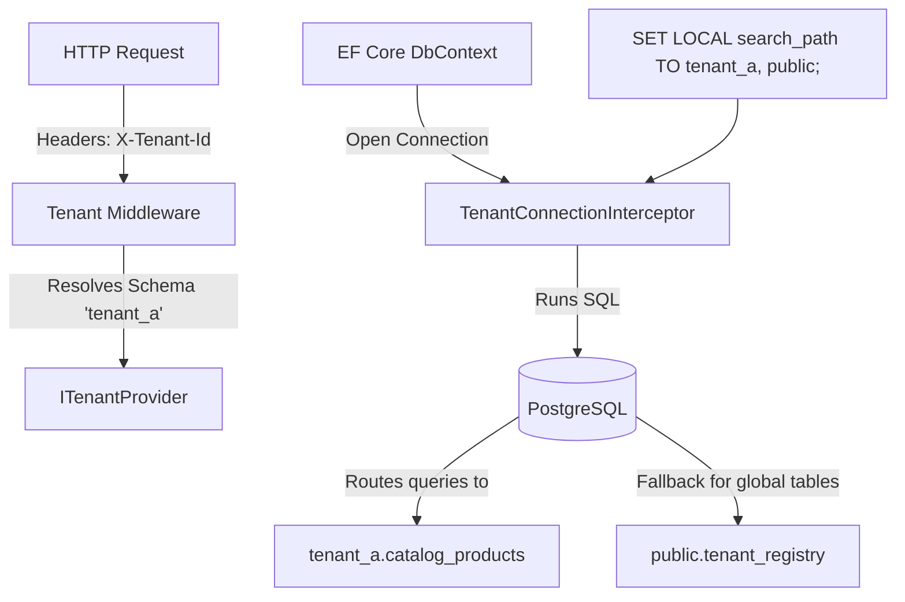

# PostgreSQL Schema-per-Tenant Modular Monolith Guide

In a **Schema-per-Tenant** architecture using PostgreSQL and EF Core, each tenant gets their own dedicated database schema (e.g. `tenant_a`, `tenant_b`). Within each tenant's schema, tables are isolated by module using table prefixes (e.g. `catalog_products`, `ordering_orders`).

To implement this efficiently in .NET without memory bloat or startup lag, we use PostgreSQL's native **`search_path`** connection setting.

---

## 1. The PostgreSQL `search_path` Pattern

Normally, dynamically changing schemas in EF Core requires overriding `OnModelCreating` per request. However, EF Core caches database models globally based on context configurations. Changing schemas dynamically forces EF Core to rebuild and cache a separate model metadata tree for every single tenant, resulting in **extreme memory leaks and slow requests**.

By using PostgreSQL's **`search_path`**, we solve this:
1. **Schema-less EF Mapping**: We map entities to bare table names (`catalog_products`, `ordering_orders`) without specifying any schema in C#.
2. **Dynamic Connection Scoping**: On opening a database connection, a `DbConnectionInterceptor` executes `SET LOCAL search_path TO tenant_a, public;`.
3. **Database-level Routing**: PostgreSQL automatically maps the schema-less queries (e.g. `SELECT * FROM catalog_products`) to the active tenant's schema (`tenant_a.catalog_products`). Shared global tables can live in the `public` schema.



---

## 2. Directory Structure

```
Monolith/
├── Modules/
│   ├── Catalog/
│   │   ├── Domain/                 # Entities, Value Objects, Domain Events (all internal)
│   │   ├── Application/            # MediatR Handlers, public DTOs, interfaces
│   │   ├── Infrastructure/         # CatalogDbContext, Repositories (all internal)
│   │   └── UI/                     # Blazor Pages, Catalog endpoints
│   └── Ordering/
│       ├── Domain/
│       ├── ...
├── Shared/
│   ├── Domain/                     # Common DDD base classes & ITenantProvider
│   ├── Infrastructure/             # TenantConnectionInterceptor, TenantProvisioningService
│   └── UI/                         # Layouts and global CSS
├── Program.cs                      # Main entrypoint: registers TenantProvider, DbContexts, maps UI
└── Monolith.csproj                 # Single project managing all NuGet dependencies
```

---

## 3. Key Implementation Patterns

### Pattern A: Tenant Provider (In `Monolith/Shared/Domain`)

Resolves the current tenant's schema name from the HTTP context.

```csharp
namespace Monolith.Shared.Domain;

public interface ITenantProvider
{
    string GetTenantSchema(); // e.g. returns "tenant_a" or "tenant_b"
}
```

---

### Pattern B: Connection Interceptor (In `Monolith/Shared/Infrastructure`)

Intercepts connection events and applies the search path.

```csharp
using System.Data.Common;
using Microsoft.EntityFrameworkCore.Diagnostics;
using Monolith.Shared.Domain;

namespace Monolith.Shared.Infrastructure;

public class TenantConnectionInterceptor(ITenantProvider tenantProvider) : DbConnectionInterceptor
{
    public override async ValueTask ConnectionOpenedAsync(
        DbConnection connection,
        ConnectionEndEventData eventData,
        CancellationToken cancellationToken = default)
    {
        await base.ConnectionOpenedAsync(connection, eventData, cancellationToken);
        
        var tenantSchema = tenantProvider.GetTenantSchema();
        
        await using var command = connection.CreateCommand();
        // Sets the search path for the duration of the transaction/connection
        // Always sanitize tenantSchema parameter or validate it against a list of active tenants!
        command.CommandText = $"SET LOCAL search_path TO \"{tenantSchema}\", public;";
        await command.ExecuteNonQueryAsync(cancellationToken);
    }
}
```

---

### Pattern C: DbContext Configurations (In `Monolith/Modules/Catalog/Infrastructure`)

Map tables using prefixes, but **do not** define default schemas or specify schema parameters.

```csharp
using Microsoft.EntityFrameworkCore;
using Monolith.Modules.Catalog.Domain;

namespace Monolith.Modules.Catalog.Infrastructure;

internal class CatalogDbContext(DbContextOptions<CatalogDbContext> options) : DbContext(options)
{
    public DbSet<Product> Products => Set<Product>();

    protected override void OnModelCreating(ModelBuilder modelBuilder)
    {
        base.OnModelCreating(modelBuilder);

        // Map Catalog entities to prefixed, schema-less tables
        modelBuilder.Entity<Product>(builder =>
        {
            builder.ToTable("catalog_products"); // Schema-less table name
            builder.HasKey(p => p.Id);
            builder.Property(p => p.Name).IsRequired().HasMaxLength(200);
        });
    }
}
```

---

## 4. Tenant Provisioning & Dynamic Migrations

When onboarding a new tenant, you must dynamically create their PostgreSQL schema and apply EF Core migrations against it.

### Implementing TenantProvisioningService (In `Monolith/Shared/Infrastructure`)

```csharp
using Microsoft.EntityFrameworkCore;
using Npgsql;

namespace Monolith.Shared.Infrastructure;

public class TenantProvisioningService(
    DbContextOptions<CatalogDbContext> dbContextOptions) // Inject DB options
{
    public async Task ProvisionTenantAsync(string tenantSchema)
    {
        // 1. Sanitize schema name to prevent SQL Injection
        if (string.IsNullOrWhiteSpace(tenantSchema) || !tenantSchema.All(c => char.IsLetterOrDigit(c) || c == '_'))
        {
            throw new ArgumentException("Invalid tenant schema name.");
        }

        // 2. Create the schema and the Migration History table target connection
        using var context = new DbContext(dbContextOptions);
        var connection = context.Database.GetDbConnection();
        await connection.OpenAsync();

        await using (var command = connection.CreateCommand())
        {
            command.CommandText = $"CREATE SCHEMA IF NOT EXISTS \"{tenantSchema}\";";
            await command.ExecuteNonQueryAsync();
        }

        // 3. Set search path to target the new tenant schema for migration execution
        await using (var command = connection.CreateCommand())
        {
            command.CommandText = $"SET search_path TO \"{tenantSchema}\";";
            await command.ExecuteNonQueryAsync();
        }

        // 4. Run database migrations to scaffold the tables
        // EF Core will run migrations within the context of the set 'search_path',
        // creating the tables and __EFMigrationsHistory inside the new tenant schema.
        await context.Database.MigrateAsync();
    }
}
```

---

## 5. Architectural Verification via `NetArchTest`

Maintain strict boundary controls between code namespaces:

```csharp
using NetArchTest.Rules;
using Xunit;

namespace Monolith.Tests;

public class ArchitectureTests
{
    [Fact]
    public void Catalog_Should_Not_Depend_On_Ordering_Infrastructure()
    {
        var result = Types.InAssembly(typeof(Monolith.Program).Assembly)
            .That()
            .ResideInNamespace("Monolith.Modules.Catalog")
            .ShouldNot()
            .HaveDependencyOn("Monolith.Modules.Ordering.Infrastructure")
            .GetResult();

        Assert.True(result.IsSuccessful, "Catalog cannot depend on Ordering Infrastructure!");
    }
}
```
